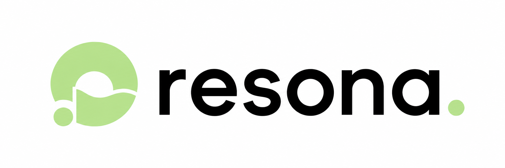

# Resona

Resona is an adaptive healing-music web application. It combines a procedural Web Audio engine with a persistent Vibe Agent that can reshape each user's pages, navigation, theme, and custom synthesis configuration while the protected player shell and microphone remain fixed. The users can also DIY their interface if they are not satisfied.
Resona is created by Jingwen Hu and FuhangFu, with the help of AI and tutors.

## Included

- Flask application factory with `auth_bp`, `admin_bp`, `player_bp`, `agent_bp`, and `storage_bp`
- Registration, login, password reset flow, profiles, session history, and a separate admin login
- A simplified default Home page plus a full Advanced audio page, driven by each user's private `nav.json`
- A sandbox-safe `window.ResonaFiles` API for persistent front-end text, uploads, folders, reads, moves, and deletes inside each user's private `data/` directory
- Continuous binaural and colored-noise synthesis plus a six-layer ambient Web Audio synth with drone, harmonic pad, analog drift, weather texture, shimmer, felt accents, and a full spatial effects chain
- Conflict-safe binaural tuning with mutually exclusive exact left/right ear frequencies or a symmetric beat-frequency difference
- Atmosphere, tonal-centre, and accessible rotary controls, with a private browser-side LSTM chord generator that can conduct every pitched synth layer without a generation API
- Voice or text Vibe Agent interface with validated HTML, CSS, JS, JSON, SVG, and Markdown writes
- A fail-closed prompt safety review that rejects potentially harmful, illegal, abusive, privacy-invasive, or safeguard-evasion requests before snapshots or agent execution
- Multi-turn autonomous agent runtime with list, read, write, replace, move, delete, navigation, validation, and registered-skill tools
- Per-user 1 GB quotas, authenticated storage routes, path isolation, snapshots, and rollback
- Server-side OpenAI-compatible API proxying with a client credential placeholder
- Resend-powered registration welcome emails and secure password reset links
- Exabyte Accounts OIDC sign-in with PKCE, immutable-sub account mapping, explicit linking, and automatic private-workspace provisioning
- Admin controls for shared AI and email provider configuration, users, prompts, skills, and additional admins

## Local setup

```sh
python3 -m venv .venv
.venv/bin/python -m pip install -r requirements.txt
cp .env.example .env
FLASK_APP=run.py .venv/bin/flask create-admin
FLASK_APP=run.py .venv/bin/flask run
```

For local debugging with detailed AI agent traces, run:

```sh
python run.py debug
```

This enables Flask debug mode and prints each user's AI prompt, step progress, model response, tool call and arguments, tool result, validation event, and final outcome. Large strings are truncated, and credentials, API keys, passwords, tokens, authorization headers, and secrets are redacted. A normal `python run.py` launch keeps agent tracing disabled.

Set `SECRET_KEY` before deployment. To enable Vibe Agent calls, either set `CLOSEAI_API_KEY` on the server or save it from the admin control center. Browsers send only the literal `{{RESONA_SERVER_API_KEY}}` placeholder; Resona resolves the active server key, base URL, and model and makes the provider request itself. No provider key is generated for or exposed to an individual user. User workspaces default to `instance/storage`; use `RESONA_STORAGE_ROOT` to mount a dedicated server volume.

`CLOSEAI_BASE_URL` may point to any public HTTPS service implementing the OpenAI chat-completions protocol. Resona accepts a host root, a versioned base such as `https://api.openai.com/v1` or `https://openrouter.ai/api/v1`, or a complete URL ending in `/chat/completions`. Localhost, credential-bearing URLs, and private-network IP addresses remain blocked to prevent server-side request abuse.

Set `CLOSEAI_PREFER_ENV=1` in managed deployments so the current environment key, base URL, and model are used by default instead of old provider metadata retained in SQLite. A non-empty API key explicitly saved through the admin interface is a deliberate runtime override and takes effect immediately; clearing that saved key falls back to the environment. The bundled GitHub Actions deployment enables this behavior automatically.

To enable email, save a Resend API key, sender name, and sender email in the admin control center, or set `RESEND_API_KEY`, `RESEND_FROM_EMAIL`, and `RESEND_FROM_NAME` on the server. Registration sends a 24-hour verification link and fails closed if production email delivery is unavailable. New accounts remain signed out and cannot sign in until that link is used. Email changes stay pending until the new address is verified; password recovery uses a separate single-use link that expires after 30 minutes. Set `PUBLIC_BASE_URL` to the public HTTPS origin in production so emailed links always use the canonical application address. The sender domain must be verified in Resend.

Login, registration, and account edits use the self-hosted Cap.js proof-of-work CAPTCHA. Every third AI request in a rolling one-hour window requires a fresh CAPTCHA, and each verification token is consumed once. The official widget and WASM solver are served locally under the application CSP. `CAPTCHA_CHALLENGE_COUNT` and `CAPTCHA_CHALLENGE_DIFFICULTY` default to 50 and 4.

To enable **Sign in with Exabyte**, register a confidential `Resona` client in Exabyte Accounts with the exact callbacks `http://localhost:5000/auth/exabyte/callback` and `https://resona.neuorise.com/auth/exabyte/callback`, scopes `openid profile email`, grants `authorization_code refresh_token`, owning organization `Exabyte`, and permission namespace `resona`. Set the client ID, one-time client secret, and separate profile-webhook signing secret in **Control center → Exabyte Accounts** after deployment. Configure the exact webhook endpoint `https://resona.neuorise.com/webhooks/exabyte`, use `https://resona.neuorise.com/privacy` as the client privacy-policy URL, test the webhook in Accounts, and then enable delivery. Secrets are encrypted at rest and never redisplayed. Resona verifies revisioned webhook events, keeps provider profiles and avatars synchronized, revokes local sessions on lifecycle events, and deletes centrally anonymized non-final-admin accounts after seven days. OIDC continues to map only by immutable `sub`, fetch live UserInfo, and immediately revoke returned tokens.

When `ADMIN_PASSWORD` is non-empty, startup creates or synchronizes the administrator named by `ADMIN_USERNAME` (default `admin`). `ADMIN_EMAIL` is optional and defaults to `<username>@resona.local`. Restart the application after changing these values.

The Vibe Agent continues calling the model and workspace tools until it explicitly finishes with a valid workspace. `AGENT_MAX_STEPS` defaults to 80 and can be adjusted from 1–200 in the admin provider panel. On every turn the agent receives its current step, total limit, and remaining budget, with instructions to avoid redundant work without rushing or skipping validation. Every run creates one rollback snapshot before the first tool call. Registered HTTPS skills are exposed through `invoke_skill`; the server credential is attached only when a skill uses the configured provider's exact HTTPS origin, and direct image or audio results can be saved into the user's quota-controlled storage.

Sandboxed user pages can persist application data through the injected `window.ResonaFiles` bridge. Its Promise-based methods are `list`, `read`, `write`, `upload`, `mkdir`, `move`, and `delete`; all paths are relative to the current user's private `data/` directory. Requests are relayed through the authenticated player shell with CSRF, path, extension, per-file size, and account-quota validation. The Vibe Agent receives the complete API contract in its system instructions so it can build durable journals, settings, collections, and upload interfaces without direct network or session access.

The ambient engine is implemented with the native Web Audio API and uses six independently generated layers followed by mud and air EQ, saturation, chorus, compression, a generated 9.5-second convolution reverb, filtered delay, limiting, and analysis. Manual harmony follows the selected Restore, Melancholy, or Deep meditation atmosphere and C/D/E-flat/F/G/A tonal centre. Generated harmony disables that internal cycle and retunes all pitched layers while leaving weather texture and the independent noise generator untuned. The synth Output control is a pre-mixer trim; ambient and master volume remain separate.

The trained chord checkpoint is exported with `scripts/export_chord_model.py` into a browser-readable float32 tensor package. Each user receives the roughly 3 MB package in `static/chord-model/`, counted against their private storage quota. The player downloads those authenticated static files and performs the LSTM forward pass, top-k sampling, and chord decoding entirely in JavaScript; there is no chord-generation backend endpoint. The model is the supplied triad LSTM (not a Transformer) with 3,861 chord labels and a 50-chord maximum context.

## Tests

```sh
.venv/bin/python -m pytest -q
```

## Production deployment

The `Deploy Resona` GitHub Actions workflow deploys pushes to `main` (or manual runs) to `resonahost@157.245.192.56`, installs missing Ubuntu packages, installs and verifies Python dependencies, and runs Resona with Gunicorn behind Nginx at `https://resona.neuorise.com`.

Configure these GitHub repository or `production` environment secrets before running it:

- `SSH_PRIVATE_KEY`: private key authorized for `resonahost`
- `SECRET_KEY`
- `ADMIN_USERNAME`
- `ADMIN_PASSWORD`
- `CLOSEAI_API_KEY`
- `RESEND_API_KEY`
- `RESEND_FROM_EMAIL`: sender address on a domain verified in Resend
- `LETSENCRYPT_EMAIL`: email used to register the Let’s Encrypt certificate
- Exabyte client ID and secret: saved through the protected admin control center, not GitHub secrets

The `resonahost` account must already exist and have non-interactive `sudo` access for package, systemd, Nginx, and Certbot management. DNS for `resona.neuorise.com` must point to `157.245.192.56`, and inbound ports 80 and 443 must be open. Deployment obtains or reuses a Let’s Encrypt certificate through the webroot challenge, enables automatic renewal, redirects HTTP to HTTPS, enables HSTS, verifies the live certificate locally, and sets `SESSION_COOKIE_SECURE=1`.

Deployments synchronize application code into `/opt/resona` while explicitly excluding `.env`, `.venv`, and the entire `instance/` directory. Consequently, `instance/resona.sqlite3`, user storage, and other persistent state are retained. Before restarting the service, the workflow also keeps the five newest SQLite copies under `instance/backups/`.

The development server is not intended for production. Deploy behind a production WSGI server and TLS, set `SESSION_COOKIE_SECURE=1`, and back up the database and storage volume together. Environment-managed provider credentials are preferred for production; credentials saved through the control center are stored in the Resona database and are never rendered back to administrators or clients.
